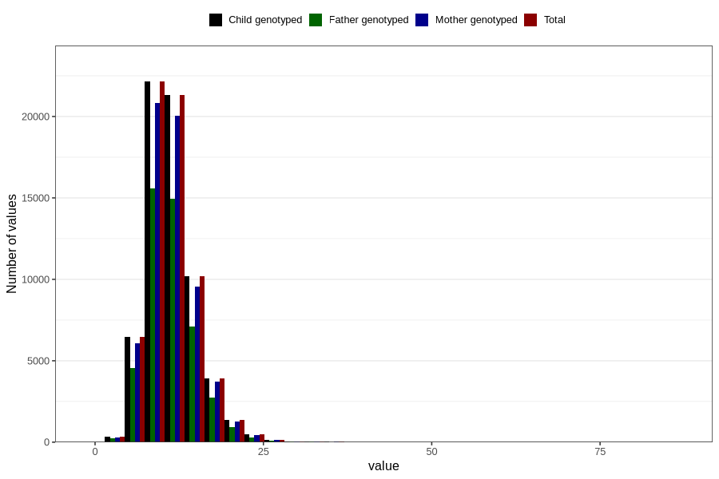

# iron
Variable mapping to `JERN` in `Skjema2_beregning_CDW_v12`.
- Number of values:

| Value | Total | Child genotyped | Mother genotyped | Father genotyped |
| ----- | ----- | --------------- | ---------------- | ---------------- |
| Missing | 14283 | 14283 | 13548 | 6691 |
| Non-missing | 66523 | 66523 | 62476 | 46472 |
| 25th percentile | 8.92 | 8.92 | 8.92 | 8.91 |
| 50th percentile | 10.86 | 10.86 | 10.86 | 10.85 |
| 75th percentile | 13.25 | 13.25 | 13.24 | 13.2 |
| Mean | 11.384154051982 | 11.384154051982 | 11.3799785517639 | 11.3425561628507 |
| Standard deviation | 3.71887860248616 | 3.71887860248616 | 3.70819781316326 | 3.63183718979636 |
| N | 66523 | 66523 | 62476 | 46472 |

