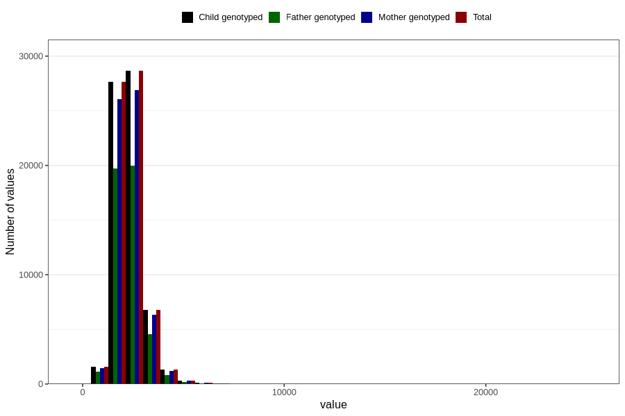

# kcal
Variable mapping to `KCAL` in `Skjema2_beregning_CDW_v12`.
- Number of values:

| Value | Total | Child genotyped | Mother genotyped | Father genotyped |
| ----- | ----- | --------------- | ---------------- | ---------------- |
| Missing | 14283 | 14283 | 13548 | 6691 |
| Non-missing | 66523 | 66523 | 62476 | 46472 |
| 25th percentile | 1876.66 | 1876.66 | 1875.58 | 1868.3225 |
| 50th percentile | 2228.91 | 2228.91 | 2227.45 | 2214.9 |
| 75th percentile | 2655.395 | 2655.395 | 2653.06 | 2635.2625 |
| Mean | 2329.87407889001 | 2329.87407889001 | 2327.83247455023 | 2309.75226415906 |
| Standard deviation | 726.964788945028 | 726.964788945028 | 723.717544523288 | 696.956815333227 |
| N | 66523 | 66523 | 62476 | 46472 |

