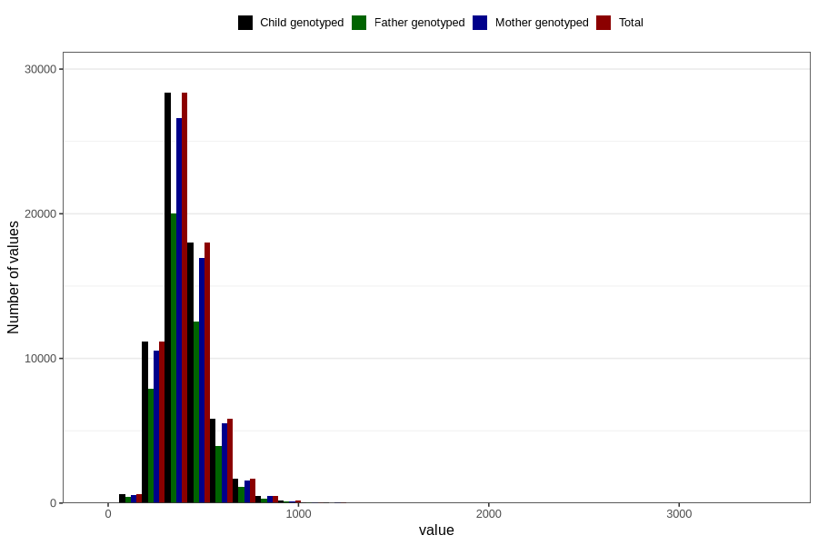

# magnesium
Variable mapping to `MAGNESIUM` in `Skjema2_beregning_CDW_v12`.
- Number of values:

| Value | Total | Child genotyped | Mother genotyped | Father genotyped |
| ----- | ----- | --------------- | ---------------- | ---------------- |
| Missing | 14283 | 14283 | 13548 | 6691 |
| Non-missing | 66523 | 66523 | 62476 | 46472 |
| 25th percentile | 320.675 | 320.675 | 320.6075 | 319.8075 |
| 50th percentile | 387.91 | 387.91 | 387.74 | 386.195 |
| 75th percentile | 467.67 | 467.67 | 467.41 | 464.985 |
| Mean | 404.913176645671 | 404.913176645671 | 404.664555349254 | 402.477417369599 |
| Standard deviation | 130.730765237289 | 130.730765237289 | 130.353484528933 | 126.861857795443 |
| N | 66523 | 66523 | 62476 | 46472 |

