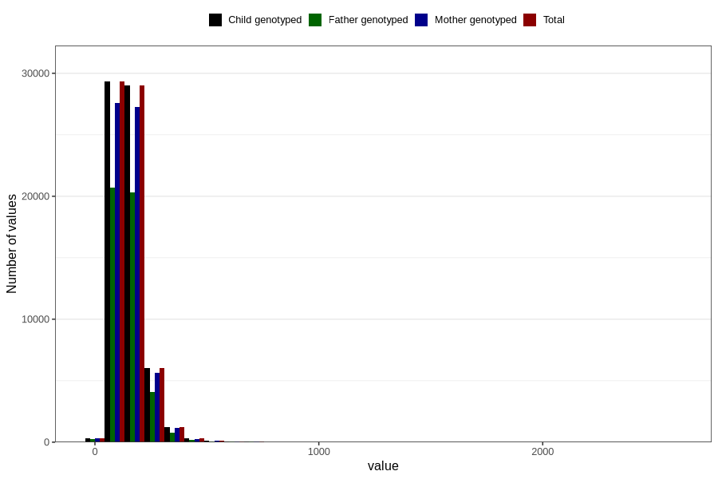

# mono_and_disaccharides
Variable mapping to `MONO_DISAKK` in `Skjema2_beregning_CDW_v12`.
- Number of values:

| Value | Total | Child genotyped | Mother genotyped | Father genotyped |
| ----- | ----- | --------------- | ---------------- | ---------------- |
| Missing | 14283 | 14283 | 13548 | 6691 |
| Non-missing | 66523 | 66523 | 62476 | 46472 |
| 25th percentile | 108.275 | 108.275 | 108.17 | 107.65 |
| 50th percentile | 140.17 | 140.17 | 140.01 | 139.37 |
| 75th percentile | 181.145 | 181.145 | 180.9525 | 179.71 |
| Mean | 152.828071945042 | 152.828071945042 | 152.593626512581 | 151.143674470649 |
| Standard deviation | 72.7500431404378 | 72.7500431404378 | 72.4352796505893 | 69.6471587560119 |
| N | 66523 | 66523 | 62476 | 46472 |

