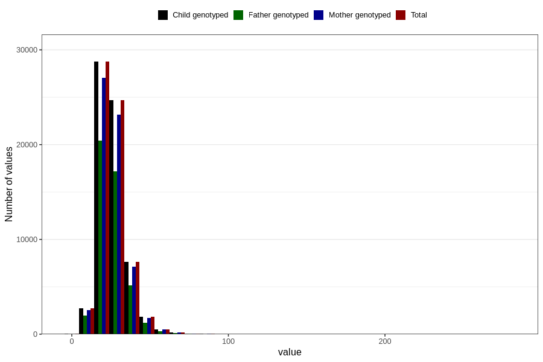

# monounsaturated_fatty_acids
Variable mapping to `ENUMETTET` in `Skjema2_beregning_CDW_v12`.
- Number of values:

| Value | Total | Child genotyped | Mother genotyped | Father genotyped |
| ----- | ----- | --------------- | ---------------- | ---------------- |
| Missing | 14283 | 14283 | 13548 | 6691 |
| Non-missing | 66523 | 66523 | 62476 | 46472 |
| 25th percentile | 19.98 | 19.98 | 19.9775 | 19.86 |
| 50th percentile | 24.5 | 24.5 | 24.485 | 24.33 |
| 75th percentile | 30.14 | 30.14 | 30.1 | 29.91 |
| Mean | 26.0050669693189 | 26.0050669693189 | 25.9863624431782 | 25.7693006541573 |
| Standard deviation | 9.37686011289234 | 9.37686011289234 | 9.37181337148843 | 9.07171378221468 |
| N | 66523 | 66523 | 62476 | 46472 |

