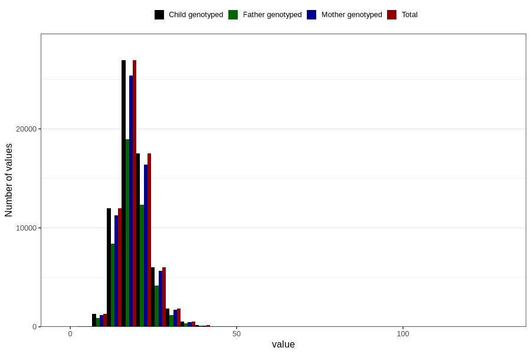

# niacin
Variable mapping to `NIACIN` in `Skjema2_beregning_CDW_v12`.
- Number of values:

| Value | Total | Child genotyped | Mother genotyped | Father genotyped |
| ----- | ----- | --------------- | ---------------- | ---------------- |
| Missing | 14283 | 14283 | 13548 | 6691 |
| Non-missing | 66523 | 66523 | 62476 | 46472 |
| 25th percentile | 16.08 | 16.08 | 16.08 | 16.09 |
| 50th percentile | 18.75 | 18.75 | 18.75 | 18.74 |
| 75th percentile | 21.83 | 21.83 | 21.82 | 21.79 |
| Mean | 19.3033038197315 | 19.3033038197315 | 19.2974855944683 | 19.2554346703391 |
| Standard deviation | 5.02442049126663 | 5.02442049126663 | 5.00911283481909 | 4.88189581259648 |
| N | 66523 | 66523 | 62476 | 46472 |

