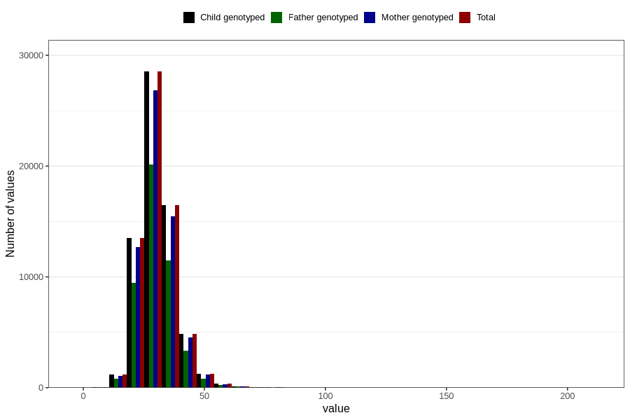

# niacin_eq
Variable mapping to `NIACIN_EQ` in `Skjema2_beregning_CDW_v12`.
- Number of values:

| Value | Total | Child genotyped | Mother genotyped | Father genotyped |
| ----- | ----- | --------------- | ---------------- | ---------------- |
| Missing | 14283 | 14283 | 13548 | 6691 |
| Non-missing | 66523 | 66523 | 62476 | 46472 |
| 25th percentile | 25.77 | 25.77 | 25.77 | 25.76 |
| 50th percentile | 29.86 | 29.86 | 29.85 | 29.78 |
| 75th percentile | 34.56 | 34.56 | 34.53 | 34.45 |
| Mean | 30.7230182042301 | 30.7230182042301 | 30.7077245662334 | 30.6149010156653 |
| Standard deviation | 7.78586022944262 | 7.78586022944262 | 7.75671834374402 | 7.5583606901873 |
| N | 66523 | 66523 | 62476 | 46472 |

