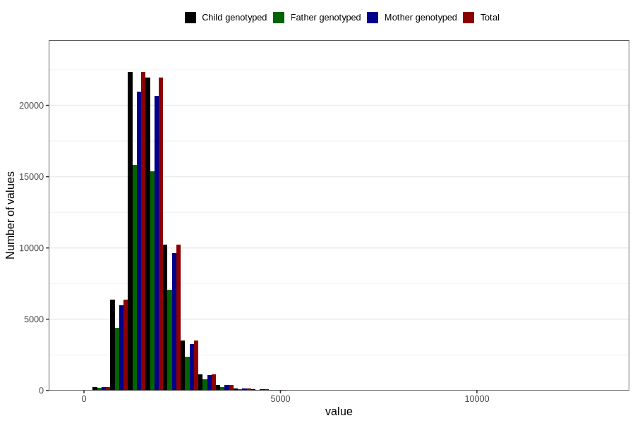

# phosphorus
Variable mapping to `FOSFOR` in `Skjema2_beregning_CDW_v12`.
- Number of values:

| Value | Total | Child genotyped | Mother genotyped | Father genotyped |
| ----- | ----- | --------------- | ---------------- | ---------------- |
| Missing | 14283 | 14283 | 13548 | 6691 |
| Non-missing | 66523 | 66523 | 62476 | 46472 |
| 25th percentile | 1350.555 | 1350.555 | 1350.19 | 1348.04 |
| 50th percentile | 1640.42 | 1640.42 | 1640.73 | 1635.075 |
| 75th percentile | 1987.005 | 1987.005 | 1985.87 | 1978.2925 |
| Mean | 1715.45074846294 | 1715.45074846294 | 1714.26364187848 | 1706.94885823722 |
| Standard deviation | 557.926566541526 | 557.926566541526 | 556.355567847894 | 543.988279750167 |
| N | 66523 | 66523 | 62476 | 46472 |

