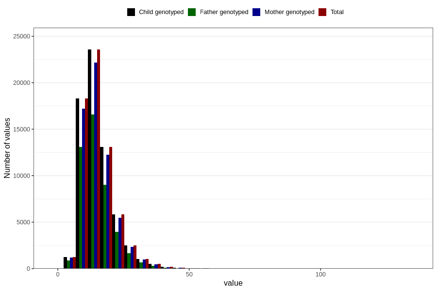

# polyunsaturated_fatty_acids
Variable mapping to `FLERUMETTET` in `Skjema2_beregning_CDW_v12`.
- Number of values:

| Value | Total | Child genotyped | Mother genotyped | Father genotyped |
| ----- | ----- | --------------- | ---------------- | ---------------- |
| Missing | 14283 | 14283 | 13548 | 6691 |
| Non-missing | 66523 | 66523 | 62476 | 46472 |
| 25th percentile | 11.01 | 11.01 | 11.01 | 10.93 |
| 50th percentile | 13.97 | 13.97 | 13.96 | 13.83 |
| 75th percentile | 18.07 | 18.07 | 18.05 | 17.87 |
| Mean | 15.2822178795304 | 15.2822178795304 | 15.2718706383251 | 15.1076534257187 |
| Standard deviation | 6.34641104503576 | 6.34641104503576 | 6.32962733972229 | 6.15889368046079 |
| N | 66523 | 66523 | 62476 | 46472 |

