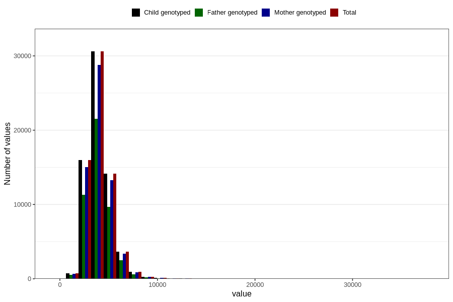

# potassium
Variable mapping to `KALIUM` in `Skjema2_beregning_CDW_v12`.
- Number of values:

| Value | Total | Child genotyped | Mother genotyped | Father genotyped |
| ----- | ----- | --------------- | ---------------- | ---------------- |
| Missing | 14283 | 14283 | 13548 | 6691 |
| Non-missing | 66523 | 66523 | 62476 | 46472 |
| 25th percentile | 3214.36 | 3214.36 | 3213.555 | 3203.355 |
| 50th percentile | 3870.74 | 3870.74 | 3869.64 | 3855.815 |
| 75th percentile | 4653.575 | 4653.575 | 4648.5025 | 4623.6175 |
| Mean | 4046.28054477399 | 4046.28054477399 | 4043.52941193418 | 4019.94334373386 |
| Standard deviation | 1304.53436495967 | 1304.53436495967 | 1299.53130745208 | 1264.64195131905 |
| N | 66523 | 66523 | 62476 | 46472 |

