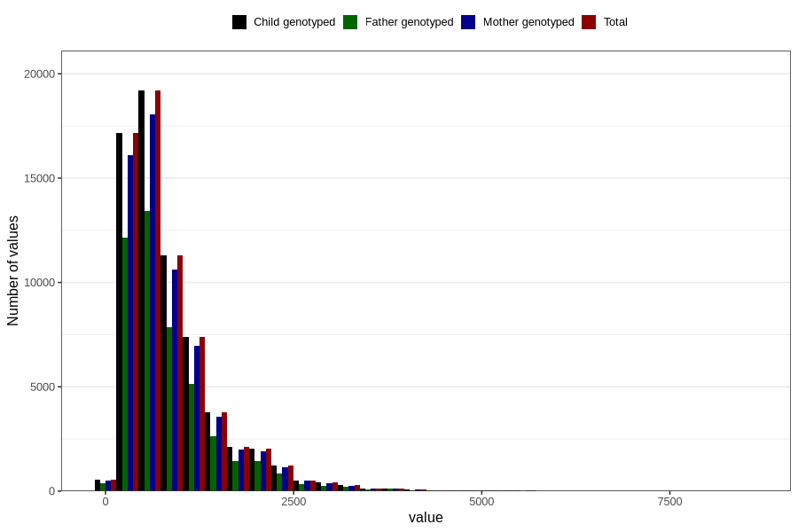

# retinol
Variable mapping to `RETINOL` in `Skjema2_beregning_CDW_v12`.
- Number of values:

| Value | Total | Child genotyped | Mother genotyped | Father genotyped |
| ----- | ----- | --------------- | ---------------- | ---------------- |
| Missing | 14283 | 14283 | 13548 | 6691 |
| Non-missing | 66523 | 66523 | 62476 | 46472 |
| 25th percentile | 426.255 | 426.255 | 426.465 | 423.8775 |
| 50th percentile | 663.3 | 663.3 | 663.285 | 656.51 |
| 75th percentile | 1084.07 | 1084.07 | 1083.7875 | 1077.42 |
| Mean | 857.678769748809 | 857.678769748809 | 857.06221236955 | 851.851843906008 |
| Standard deviation | 648.660635884043 | 648.660635884043 | 647.351894474716 | 644.250938846061 |
| N | 66523 | 66523 | 62476 | 46472 |

