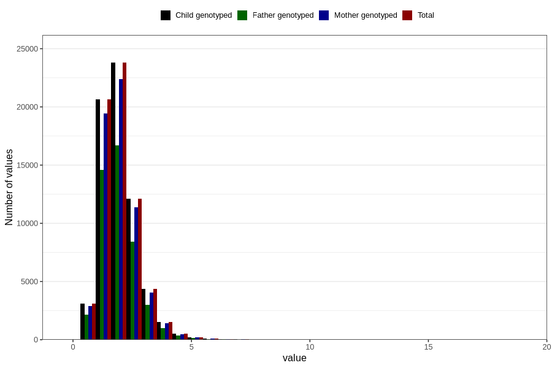

# riboflavin
Variable mapping to `RIBOFLAVIN` in `Skjema2_beregning_CDW_v12`.
- Number of values:

| Value | Total | Child genotyped | Mother genotyped | Father genotyped |
| ----- | ----- | --------------- | ---------------- | ---------------- |
| Missing | 14283 | 14283 | 13548 | 6691 |
| Non-missing | 66523 | 66523 | 62476 | 46472 |
| 25th percentile | 1.44 | 1.44 | 1.44 | 1.44 |
| 50th percentile | 1.84 | 1.84 | 1.84 | 1.83 |
| 75th percentile | 2.34 | 2.34 | 2.34 | 2.33 |
| Mean | 1.96973933827398 | 1.96973933827398 | 1.96765670017287 | 1.95767924771906 |
| Standard deviation | 0.808279681804141 | 0.808279681804141 | 0.806772003158586 | 0.787935872234938 |
| N | 66523 | 66523 | 62476 | 46472 |

