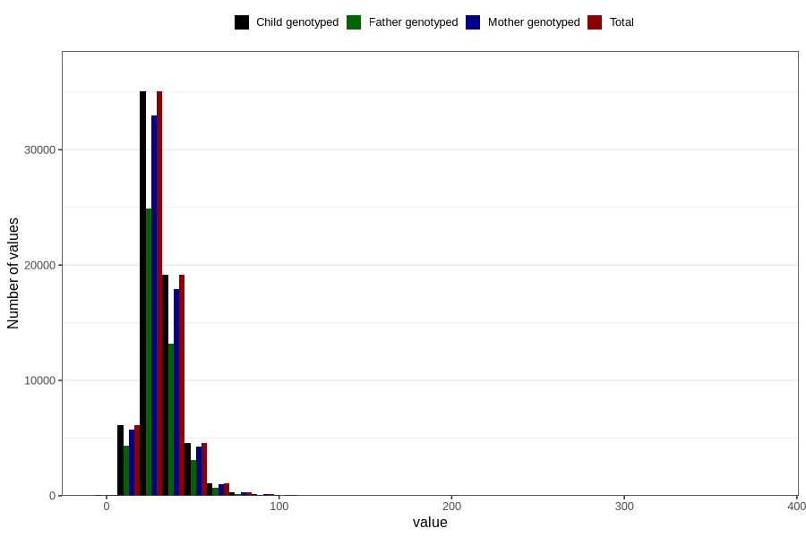

# saturated_fatty_acids
Variable mapping to `METTET` in `Skjema2_beregning_CDW_v12`.
- Number of values:

| Value | Total | Child genotyped | Mother genotyped | Father genotyped |
| ----- | ----- | --------------- | ---------------- | ---------------- |
| Missing | 14283 | 14283 | 13548 | 6691 |
| Non-missing | 66523 | 66523 | 62476 | 46472 |
| 25th percentile | 23.86 | 23.86 | 23.84 | 23.71 |
| 50th percentile | 29.41 | 29.41 | 29.39 | 29.18 |
| 75th percentile | 36.43 | 36.43 | 36.41 | 36.05 |
| Mean | 31.2780250439698 | 31.2780250439698 | 31.2474028426916 | 30.9442707436736 |
| Standard deviation | 11.5728033174001 | 11.5728033174001 | 11.5374842452611 | 11.1514375458916 |
| N | 66523 | 66523 | 62476 | 46472 |

