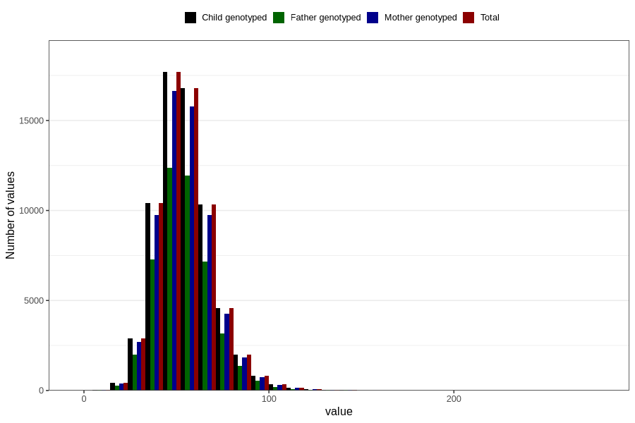

# selenium
Variable mapping to `SELEN` in `Skjema2_beregning_CDW_v12`.
- Number of values:

| Value | Total | Child genotyped | Mother genotyped | Father genotyped |
| ----- | ----- | --------------- | ---------------- | ---------------- |
| Missing | 14283 | 14283 | 13548 | 6691 |
| Non-missing | 66523 | 66523 | 62476 | 46472 |
| 25th percentile | 44.6 | 44.6 | 44.63 | 44.61 |
| 50th percentile | 53.3 | 53.3 | 53.3 | 53.27 |
| 75th percentile | 63 | 63 | 62.97 | 62.8 |
| Mean | 54.7360564015453 | 54.7360564015453 | 54.7140948524233 | 54.5923964968153 |
| Standard deviation | 15.2346344324633 | 15.2346344324633 | 15.1716169038377 | 14.9310221837365 |
| N | 66523 | 66523 | 62476 | 46472 |

