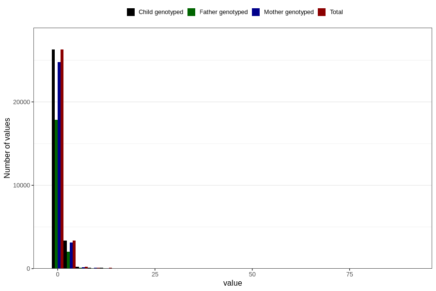

# soda_before
Variable mapping to `AA1395` in `Skjema1_v12`.
- Number of values:

| Value | Total | Child genotyped | Mother genotyped | Father genotyped |
| ----- | ----- | --------------- | ---------------- | ---------------- |
| Missing | 50761 | 50761 | 47728 | 33020 |
| Non-missing | 30045 | 30045 | 28296 | 20143 |
| Consumption have been reported by a mark but no amount given | 4 | 4 | 3 |2 |
| 25th percentile | 0 | 0 | 0 | 0 |
| 50th percentile | 0 | 0 | 0 | 0 |
| 75th percentile | 1 | 1 | 1 | 1 |
| Mean | 0.571618787656869 | 0.571618787656869 | 0.564203159792175 | 0.524105059331711 |
| Standard deviation | 1.40562123082731 | 1.40562123082731 | 1.38907984011502 | 1.3826407636532 |
| N | 30041 | 30041 | 28293 | 20141 |

