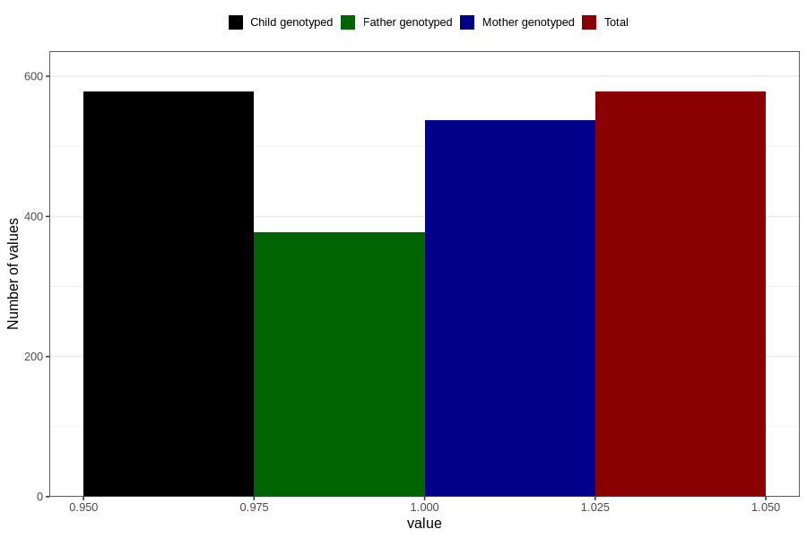

# soda_decaf
Variable mapping to `AA1397` in `Skjema1_v12`.
- Number of values:

| Value | Total | Child genotyped | Mother genotyped | Father genotyped |
| ----- | ----- | --------------- | ---------------- | ---------------- |
| Missing | 80228 | 80228 | 75487 | 52786 |
| Non-missing | 578 | 578 | 537 | 377 |
| 1 | 578 | 578 | 537 | 377 |

