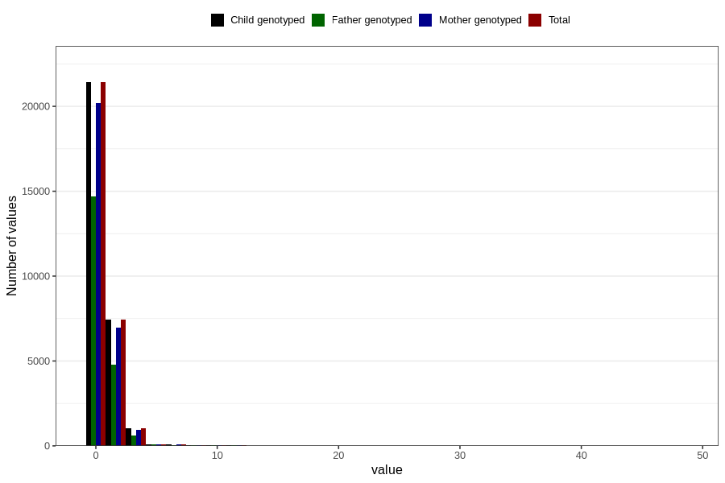

# soda_during
Variable mapping to `AA1396` in `Skjema1_v12`.
- Number of values:

| Value | Total | Child genotyped | Mother genotyped | Father genotyped |
| ----- | ----- | --------------- | ---------------- | ---------------- |
| Missing | 50603 | 50603 | 47560 | 32868 |
| Non-missing | 30203 | 30203 | 28464 | 20295 |
| Consumption have been reported by a mark but no amount given | 3 | 3 | 2 |1 |
| 0 | 21414 | 21414 | 20207 | 14695 |
| 1 | 5457 | 5457 | 5152 | 3536 |
| 2 | 1967 | 1967 | 1833 | 1237 |
| 3 | 215 | 215 | 200 | 119 |
| 4 | 815 | 815 | 757 | 493 |
| 5 | 103 | 103 | 99 | 69 |
| 6 | 81 | 81 | 79 | 54 |
| 7 | 15 | 15 | 15 | 9 |
| 8 | 54 | 54 | 49 | 32 |
| 9 | 5 | 5 | 5 | 5 |
| 10 | 28 | 28 | 24 | 18 |
| 11 | 3 | 3 | 3 | 2 |
| 12 | 36 | 36 | 33 | 21 |
| 14 | 1 | 1 | 1 | 0 |
| 16 | 2 | 2 | 2 | 1 |
| 20 | 1 | 1 | 1 | 1 |
| 28 | 1 | 1 | 0 | 0 |
| 48 | 2 | 2 | 2 | 2 |

