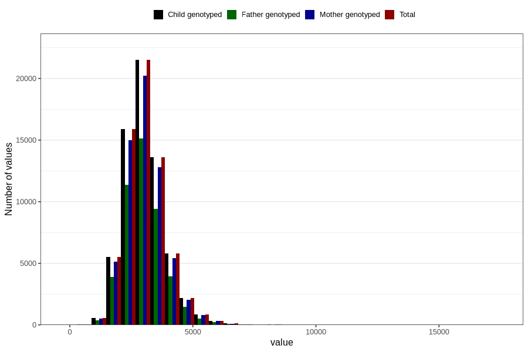

# sodium
Variable mapping to `NATRIUM` in `Skjema2_beregning_CDW_v12`.
- Number of values:

| Value | Total | Child genotyped | Mother genotyped | Father genotyped |
| ----- | ----- | --------------- | ---------------- | ---------------- |
| Missing | 14283 | 14283 | 13548 | 6691 |
| Non-missing | 66523 | 66523 | 62476 | 46472 |
| 25th percentile | 2515.795 | 2515.795 | 2515.88 | 2509.845 |
| 50th percentile | 2972.11 | 2972.11 | 2971.27 | 2958.28 |
| 75th percentile | 3499.215 | 3499.215 | 3497.2525 | 3475.4175 |
| Mean | 3059.00770500428 | 3059.00770500428 | 3057.56933654523 | 3041.01052849027 |
| Standard deviation | 831.565338958753 | 831.565338958753 | 827.882628737091 | 810.31022498581 |
| N | 66523 | 66523 | 62476 | 46472 |

