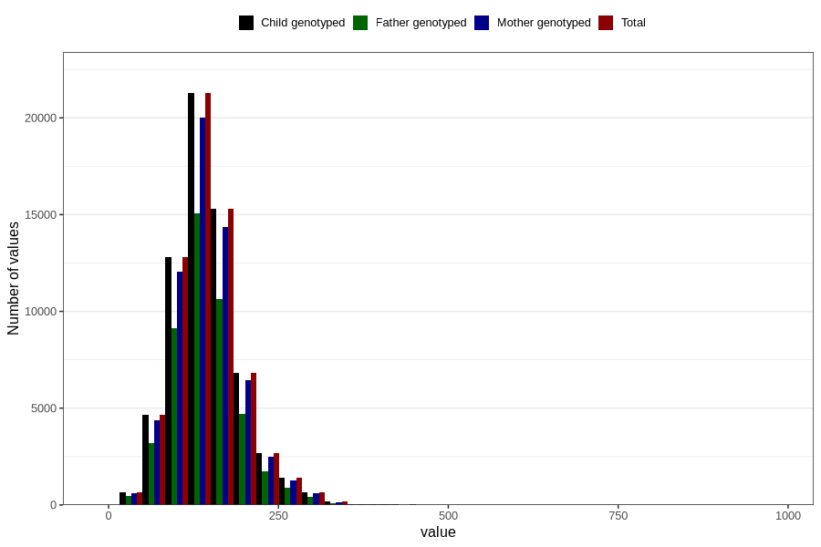

# starch
Variable mapping to `STIVELSE` in `Skjema2_beregning_CDW_v12`.
- Number of values:

| Value | Total | Child genotyped | Mother genotyped | Father genotyped |
| ----- | ----- | --------------- | ---------------- | ---------------- |
| Missing | 14283 | 14283 | 13548 | 6691 |
| Non-missing | 66523 | 66523 | 62476 | 46472 |
| 25th percentile | 114.5 | 114.5 | 114.52 | 114.22 |
| 50th percentile | 140.92 | 140.92 | 140.88 | 140.07 |
| 75th percentile | 170.73 | 170.73 | 170.67 | 169.45 |
| Mean | 145.845093576658 | 145.845093576658 | 145.785524041232 | 144.837832888621 |
| Standard deviation | 49.5767084756936 | 49.5767084756936 | 49.3468262766687 | 48.3339228464051 |
| N | 66523 | 66523 | 62476 | 46472 |

