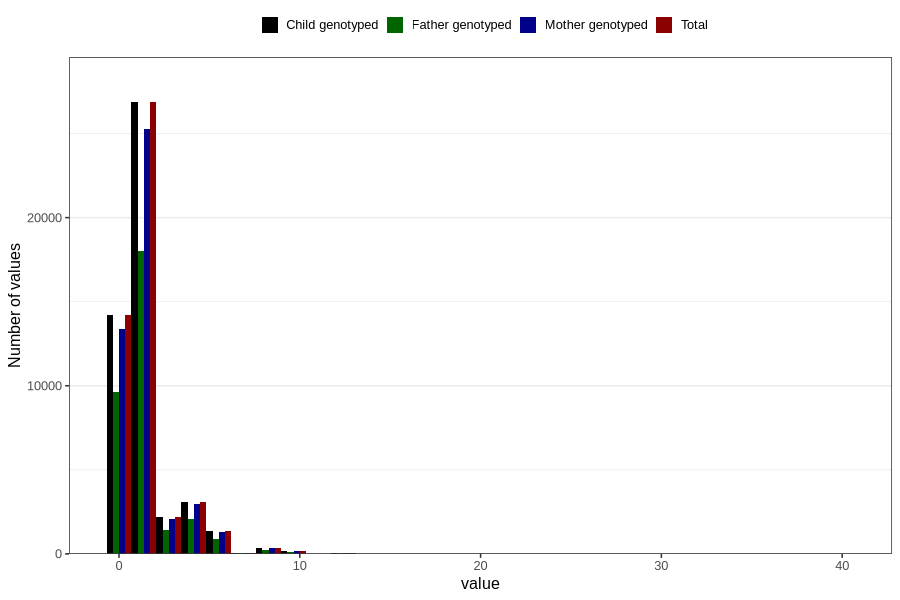

# tea_before
Variable mapping to `AA1386` in `Skjema1_v12`.
- Number of values:

| Value | Total | Child genotyped | Mother genotyped | Father genotyped |
| ----- | ----- | --------------- | ---------------- | ---------------- |
| Missing | 32391 | 32391 | 30414 | 20694 |
| Non-missing | 48415 | 48415 | 45610 | 32469 |
| Consumption have been reported by a mark but no amount given | 6 | 6 | 5 |5 |
| 0 | 14218 | 14218 | 13403 | 9654 |
| 1 | 15123 | 15123 | 14227 | 10215 |
| 2 | 11739 | 11739 | 11059 | 7810 |
| 3 | 2182 | 2182 | 2056 | 1429 |
| 4 | 3105 | 3105 | 2944 | 2066 |
| 5 | 534 | 534 | 498 | 338 |
| 6 | 845 | 845 | 787 | 532 |
| 7 | 50 | 50 | 50 | 31 |
| 8 | 370 | 370 | 346 | 232 |
| 9 | 15 | 15 | 13 | 11 |
| 10 | 152 | 152 | 148 | 96 |
| 12 | 49 | 49 | 47 | 34 |
| 14 | 6 | 6 | 6 | 5 |
| 15 | 4 | 4 | 4 | 3 |
| 16 | 6 | 6 | 6 | 3 |
| 20 | 6 | 6 | 6 | 3 |
| 24 | 3 | 3 | 3 | 1 |
| 30 | 1 | 1 | 1 | 0 |
| 40 | 1 | 1 | 1 | 1 |

