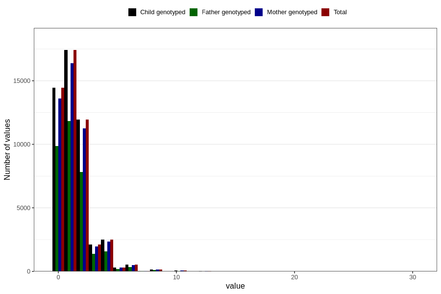

# tea_during
Variable mapping to `AA1387` in `Skjema1_v12`.
- Number of values:

| Value | Total | Child genotyped | Mother genotyped | Father genotyped |
| ----- | ----- | --------------- | ---------------- | ---------------- |
| Missing | 31283 | 31283 | 29353 | 19963 |
| Non-missing | 49523 | 49523 | 46671 | 33200 |
| Consumption have been reported by a mark but no amount given | 7 | 7 | 6 |6 |
| 0 | 14440 | 14440 | 13611 | 9865 |
| 1 | 17411 | 17411 | 16393 | 11838 |
| 2 | 11937 | 11937 | 11249 | 7829 |
| 3 | 2108 | 2108 | 1978 | 1364 |
| 4 | 2491 | 2491 | 2364 | 1587 |
| 5 | 313 | 313 | 296 | 191 |
| 6 | 518 | 518 | 494 | 335 |
| 7 | 34 | 34 | 34 | 23 |
| 8 | 166 | 166 | 156 | 113 |
| 9 | 8 | 8 | 7 | 3 |
| 10 | 59 | 59 | 54 | 28 |
| 11 | 2 | 2 | 2 | 1 |
| 12 | 17 | 17 | 15 | 9 |
| 14 | 3 | 3 | 3 | 3 |
| 15 | 2 | 2 | 2 | 2 |
| 16 | 3 | 3 | 3 | 1 |
| 20 | 3 | 3 | 3 | 2 |
| 30 | 1 | 1 | 1 | 0 |

