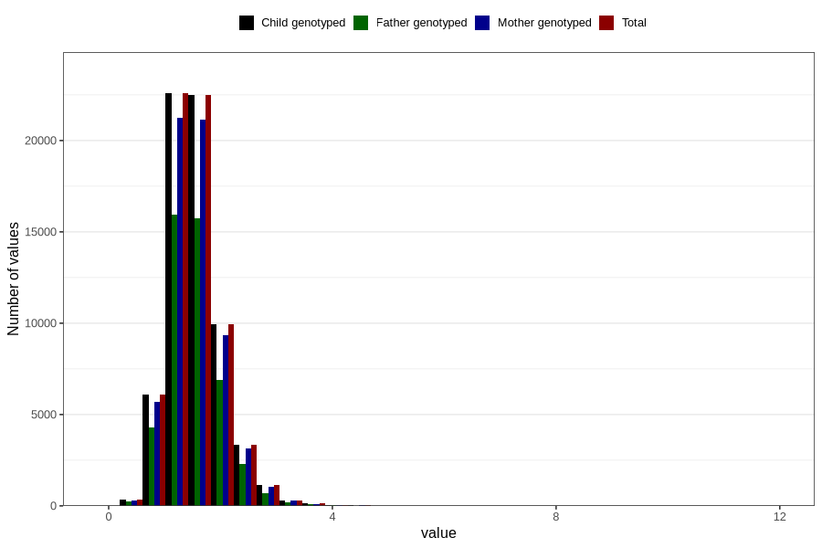

# thiamin
Variable mapping to `TIAMIN` in `Skjema2_beregning_CDW_v12`.
- Number of values:

| Value | Total | Child genotyped | Mother genotyped | Father genotyped |
| ----- | ----- | --------------- | ---------------- | ---------------- |
| Missing | 14283 | 14283 | 13548 | 6691 |
| Non-missing | 66523 | 66523 | 62476 | 46472 |
| 25th percentile | 1.23 | 1.23 | 1.23 | 1.23 |
| 50th percentile | 1.49 | 1.49 | 1.49 | 1.48 |
| 75th percentile | 1.79 | 1.79 | 1.79 | 1.79 |
| Mean | 1.55133171985629 | 1.55133171985629 | 1.5504006338434 | 1.54320192804269 |
| Standard deviation | 0.491805908225524 | 0.491805908225524 | 0.489817652690584 | 0.478138744344469 |
| N | 66523 | 66523 | 62476 | 46472 |

