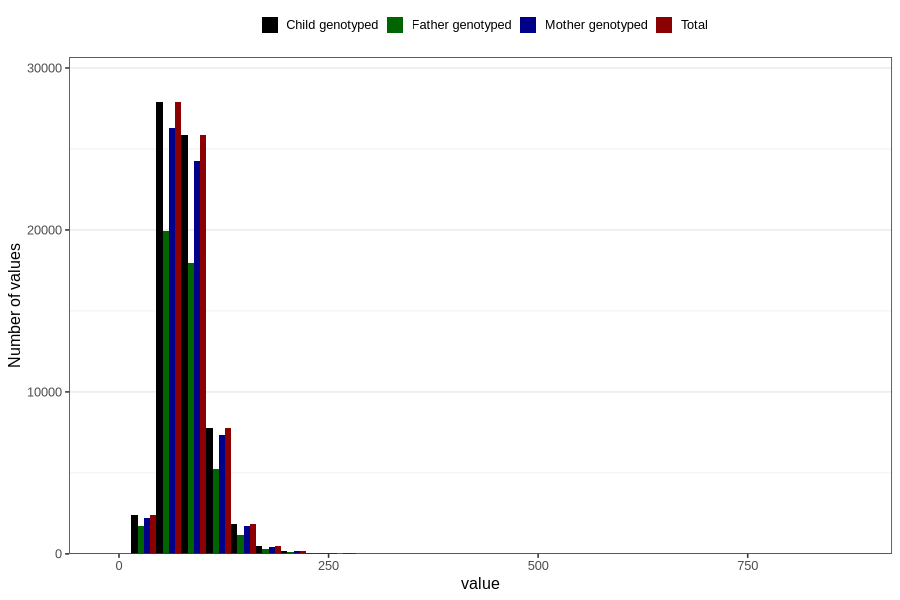

# tot_fat
Variable mapping to `TOT_FETT` in `Skjema2_beregning_CDW_v12`.
- Number of values:

| Value | Total | Child genotyped | Mother genotyped | Father genotyped |
| ----- | ----- | --------------- | ---------------- | ---------------- |
| Missing | 14283 | 14283 | 13548 | 6691 |
| Non-missing | 66523 | 66523 | 62476 | 46472 |
| 25th percentile | 62.99 | 62.99 | 62.95 | 62.59 |
| 50th percentile | 76.82 | 76.82 | 76.78 | 76.21 |
| 75th percentile | 93.87 | 93.87 | 93.79 | 92.95 |
| Mean | 81.081775626475 | 81.081775626475 | 81.0169314616813 | 80.2607202186263 |
| Standard deviation | 27.9454798718357 | 27.9454798718357 | 27.8825476534758 | 26.9319234392895 |
| N | 66523 | 66523 | 62476 | 46472 |

