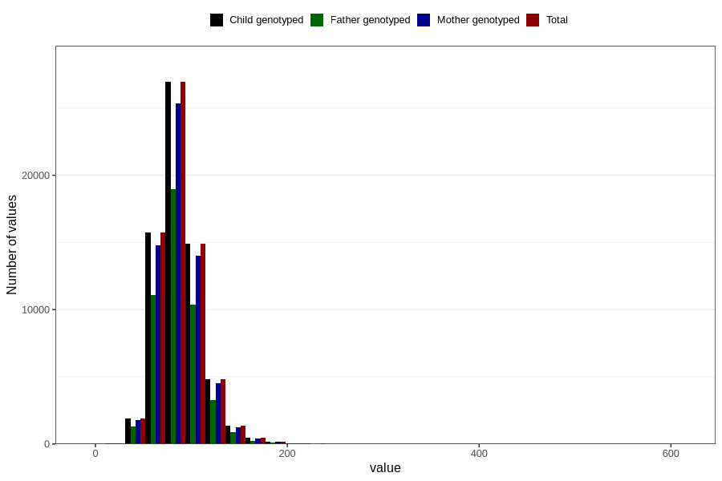

# tot_prot
Variable mapping to `TOT_PROT` in `Skjema2_beregning_CDW_v12`.
- Number of values:

| Value | Total | Child genotyped | Mother genotyped | Father genotyped |
| ----- | ----- | --------------- | ---------------- | ---------------- |
| Missing | 14283 | 14283 | 13548 | 6691 |
| Non-missing | 66523 | 66523 | 62476 | 46472 |
| 25th percentile | 72.17 | 72.17 | 72.16 | 72.08 |
| 50th percentile | 84.59 | 84.59 | 84.56 | 84.33 |
| 75th percentile | 99.13 | 99.13 | 99.0725 | 98.71 |
| Mean | 87.4475712159704 | 87.4475712159704 | 87.3946401818298 | 87.0497211223963 |
| Standard deviation | 23.7297079977107 | 23.7297079977107 | 23.6421888202651 | 23.0813195869054 |
| N | 66523 | 66523 | 62476 | 46472 |

