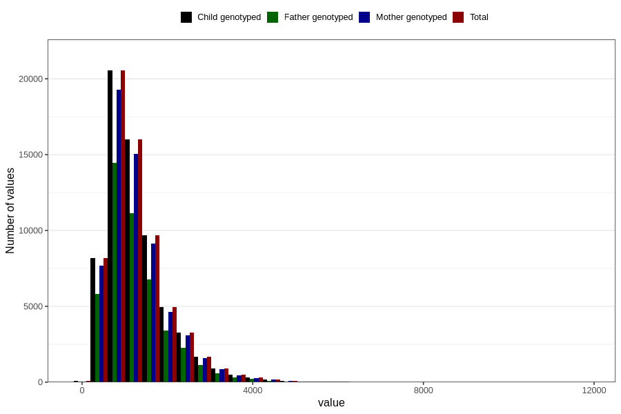

# total_retinol
Variable mapping to `RET_EKVIV` in `Skjema2_beregning_CDW_v12`.
- Number of values:

| Value | Total | Child genotyped | Mother genotyped | Father genotyped |
| ----- | ----- | --------------- | ---------------- | ---------------- |
| Missing | 14283 | 14283 | 13548 | 6691 |
| Non-missing | 66523 | 66523 | 62476 | 46472 |
| 25th percentile | 769.7 | 769.7 | 770.05 | 765.14 |
| 50th percentile | 1107.25 | 1107.25 | 1107.59 | 1099.13 |
| 75th percentile | 1593.6 | 1593.6 | 1594.1625 | 1580.4725 |
| Mean | 1289.74031297446 | 1289.74031297446 | 1289.17948812344 | 1279.13824044586 |
| Standard deviation | 751.995360560295 | 751.995360560295 | 750.305748776209 | 744.352163195915 |
| N | 66523 | 66523 | 62476 | 46472 |

