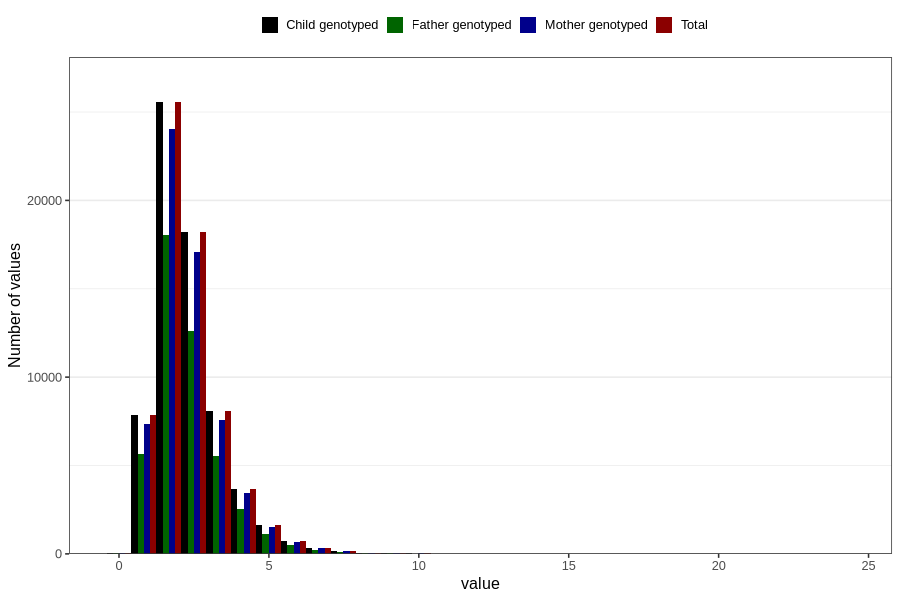

# trans_fatty_acids
Variable mapping to `TOT_TRANS` in `Skjema2_beregning_CDW_v12`.
- Number of values:

| Value | Total | Child genotyped | Mother genotyped | Father genotyped |
| ----- | ----- | --------------- | ---------------- | ---------------- |
| Missing | 14283 | 14283 | 13548 | 6691 |
| Non-missing | 66523 | 66523 | 62476 | 46472 |
| 25th percentile | 1.54 | 1.54 | 1.54 | 1.53 |
| 50th percentile | 2.07 | 2.07 | 2.07 | 2.05 |
| 75th percentile | 2.79 | 2.79 | 2.79 | 2.77 |
| Mean | 2.31945206920915 | 2.31945206920915 | 2.3180342851655 | 2.29823205370976 |
| Standard deviation | 1.16076392737766 | 1.16076392737766 | 1.1571372181663 | 1.13792767546102 |
| N | 66523 | 66523 | 62476 | 46472 |

