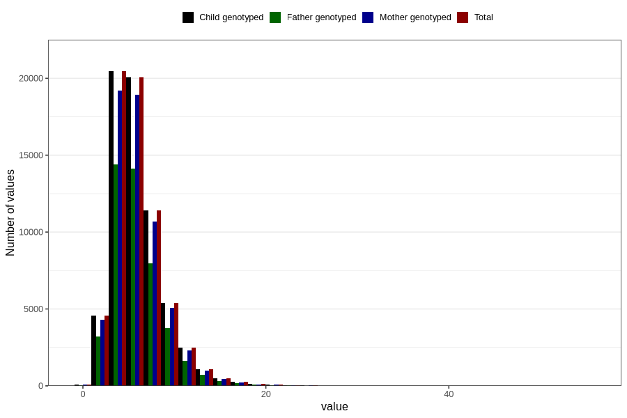

# vitamin_b12
Variable mapping to `VIT_B12` in `Skjema2_beregning_CDW_v12`.
- Number of values:

| Value | Total | Child genotyped | Mother genotyped | Father genotyped |
| ----- | ----- | --------------- | ---------------- | ---------------- |
| Missing | 14283 | 14283 | 13548 | 6691 |
| Non-missing | 66523 | 66523 | 62476 | 46472 |
| 25th percentile | 4.05 | 4.05 | 4.06 | 4.0475 |
| 50th percentile | 5.43 | 5.43 | 5.42 | 5.41 |
| 75th percentile | 7.29 | 7.29 | 7.28 | 7.25 |
| Mean | 5.99361499030411 | 5.99361499030411 | 5.98903258851399 | 5.95552827509038 |
| Standard deviation | 2.8420976454538 | 2.8420976454538 | 2.83462101999636 | 2.78637839892854 |
| N | 66523 | 66523 | 62476 | 46472 |

