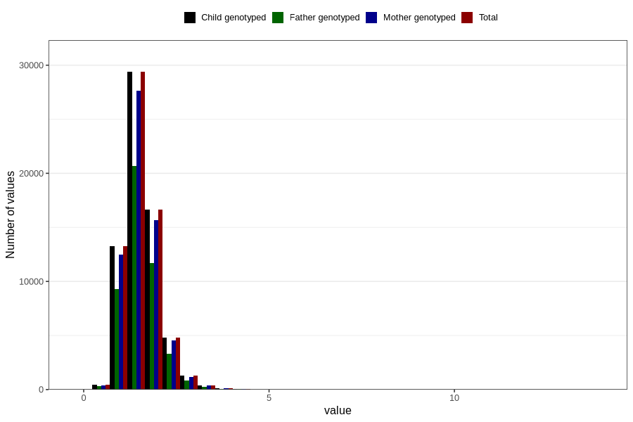

# vitamin_b6
Variable mapping to `VIT_B6` in `Skjema2_beregning_CDW_v12`.
- Number of values:

| Value | Total | Child genotyped | Mother genotyped | Father genotyped |
| ----- | ----- | --------------- | ---------------- | ---------------- |
| Missing | 14283 | 14283 | 13548 | 6691 |
| Non-missing | 66523 | 66523 | 62476 | 46472 |
| 25th percentile | 1.23 | 1.23 | 1.23 | 1.23 |
| 50th percentile | 1.49 | 1.49 | 1.49 | 1.49 |
| 75th percentile | 1.79 | 1.79 | 1.79 | 1.79 |
| Mean | 1.55771567728455 | 1.55771567728455 | 1.55668128561368 | 1.55178881907385 |
| Standard deviation | 0.49609580737344 | 0.49609580737344 | 0.493869997260234 | 0.481874500313991 |
| N | 66523 | 66523 | 62476 | 46472 |

