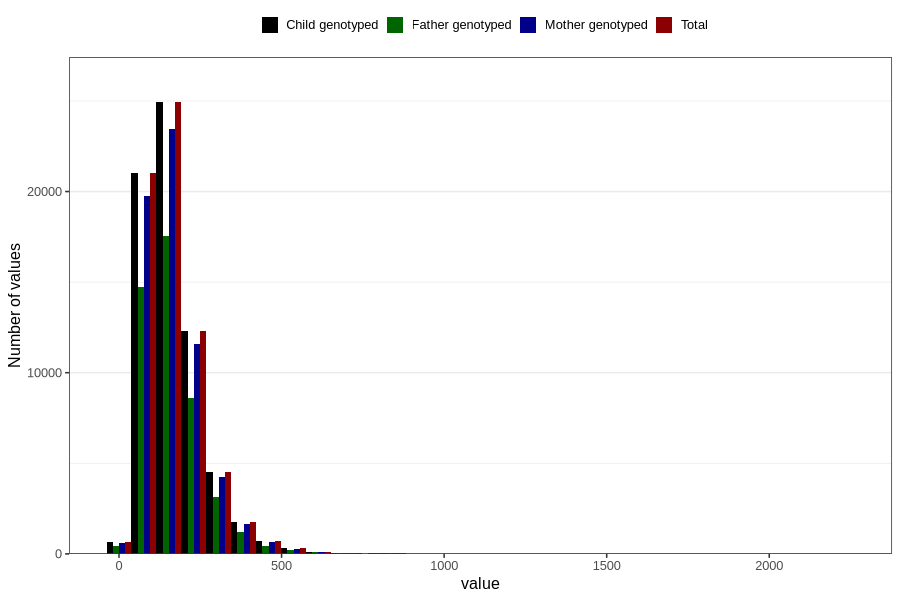

# vitamin_c
Variable mapping to `ASKORBIN` in `Skjema2_beregning_CDW_v12`.
- Number of values:

| Value | Total | Child genotyped | Mother genotyped | Father genotyped |
| ----- | ----- | --------------- | ---------------- | ---------------- |
| Missing | 14283 | 14283 | 13548 | 6691 |
| Non-missing | 66523 | 66523 | 62476 | 46472 |
| 25th percentile | 101.78 | 101.78 | 101.8075 | 101.82 |
| 50th percentile | 146.71 | 146.71 | 146.7 | 146.54 |
| 75th percentile | 206.245 | 206.245 | 206 | 205.1325 |
| Mean | 166.088589059423 | 166.088589059423 | 165.88165567578 | 165.005120502668 |
| Standard deviation | 96.56074750437 | 96.56074750437 | 95.9000172386217 | 93.9622753243808 |
| N | 66523 | 66523 | 62476 | 46472 |

