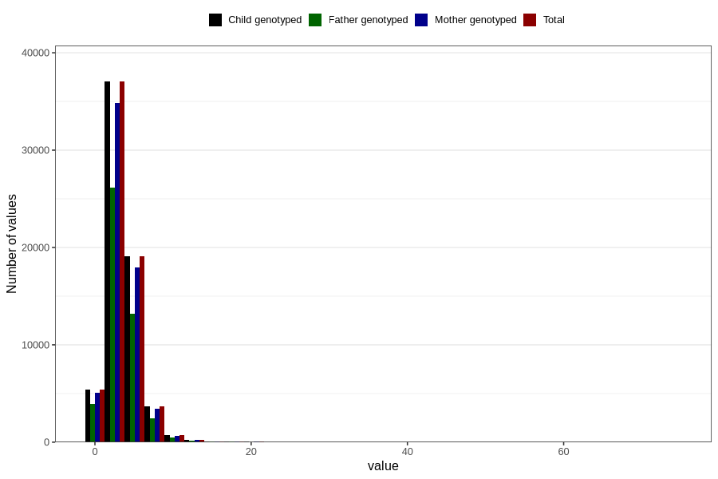

# vitamin_d
Variable mapping to `VIT_D` in `Skjema2_beregning_CDW_v12`.
- Number of values:

| Value | Total | Child genotyped | Mother genotyped | Father genotyped |
| ----- | ----- | --------------- | ---------------- | ---------------- |
| Missing | 14283 | 14283 | 13548 | 6691 |
| Non-missing | 66523 | 66523 | 62476 | 46472 |
| 25th percentile | 2.13 | 2.13 | 2.13 | 2.11 |
| 50th percentile | 3.19 | 3.19 | 3.19 | 3.15 |
| 75th percentile | 4.44 | 4.44 | 4.44 | 4.4 |
| Mean | 3.5529800219473 | 3.5529800219473 | 3.5475541007747 | 3.50451217937683 |
| Standard deviation | 2.38446864762238 | 2.38446864762238 | 2.382268686927 | 2.36237621926057 |
| N | 66523 | 66523 | 62476 | 46472 |

