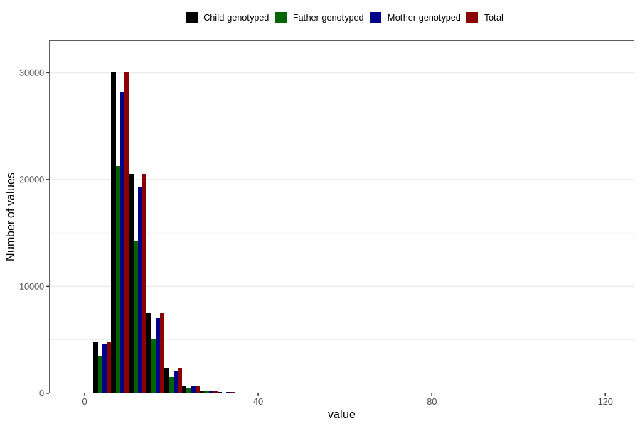

# vitamin_ed
Variable mapping to `VIT_E` in `Skjema2_beregning_CDW_v12`.
- Number of values:

| Value | Total | Child genotyped | Mother genotyped | Father genotyped |
| ----- | ----- | --------------- | ---------------- | ---------------- |
| Missing | 14283 | 14283 | 13548 | 6691 |
| Non-missing | 66523 | 66523 | 62476 | 46472 |
| 25th percentile | 7.95 | 7.95 | 7.94 | 7.9 |
| 50th percentile | 10 | 10 | 10 | 9.93 |
| 75th percentile | 12.8 | 12.8 | 12.78 | 12.69 |
| Mean | 10.8978571321197 | 10.8978571321197 | 10.8891971316986 | 10.8018992081253 |
| Standard deviation | 4.56694749937476 | 4.56694749937476 | 4.56376231368729 | 4.46164798077952 |
| N | 66523 | 66523 | 62476 | 46472 |

