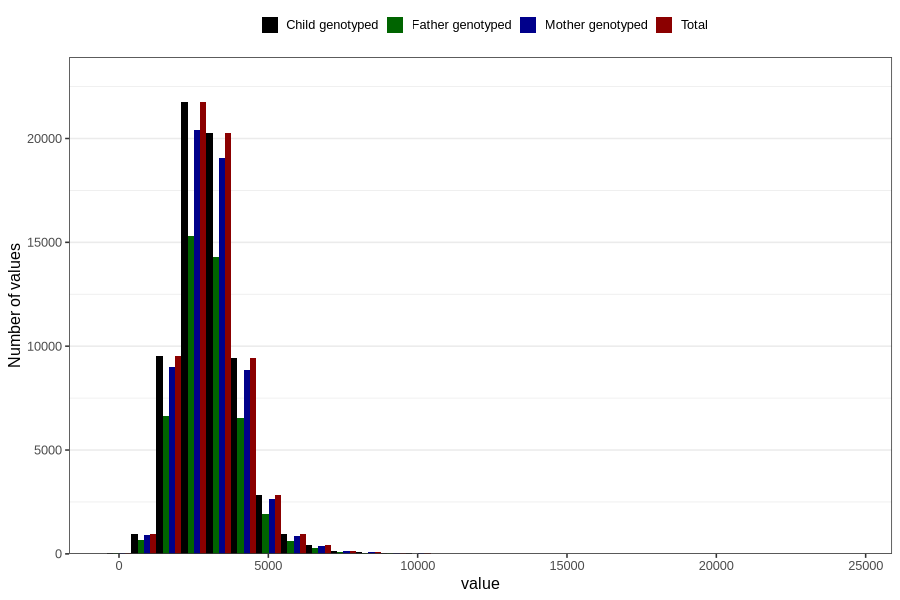

# water_g
Variable mapping to `VANN_G` in `Skjema2_beregning_CDW_v12`.
- Number of values:

| Value | Total | Child genotyped | Mother genotyped | Father genotyped |
| ----- | ----- | --------------- | ---------------- | ---------------- |
| Missing | 14283 | 14283 | 13548 | 6691 |
| Non-missing | 66523 | 66523 | 62476 | 46472 |
| 25th percentile | 2349.195 | 2349.195 | 2349.86 | 2350.7375 |
| 50th percentile | 2958.89 | 2958.89 | 2958.72 | 2957.2 |
| 75th percentile | 3620.53 | 3620.53 | 3618.115 | 3609.19 |
| Mean | 3066.67259834944 | 3066.67259834944 | 3065.11695162943 | 3057.82245438113 |
| Standard deviation | 1076.44676658417 | 1076.44676658417 | 1075.34615544054 | 1053.58006323681 |
| N | 66523 | 66523 | 62476 | 46472 |

