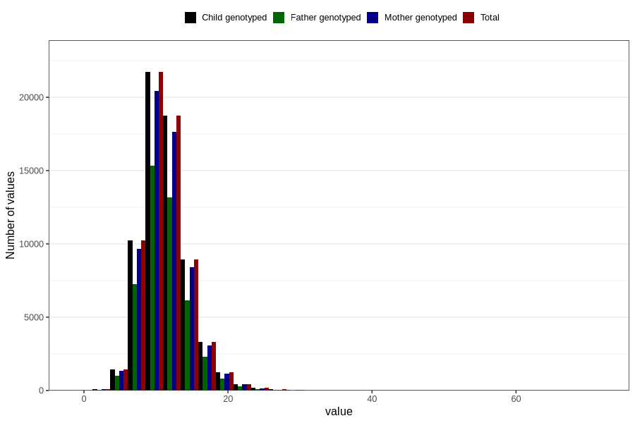

# zinc
Variable mapping to `SINK` in `Skjema2_beregning_CDW_v12`.
- Number of values:

| Value | Total | Child genotyped | Mother genotyped | Father genotyped |
| ----- | ----- | --------------- | ---------------- | ---------------- |
| Missing | 14283 | 14283 | 13548 | 6691 |
| Non-missing | 66523 | 66523 | 62476 | 46472 |
| 25th percentile | 9.18 | 9.18 | 9.18 | 9.16 |
| 50th percentile | 10.97 | 10.97 | 10.97 | 10.94 |
| 75th percentile | 13.03 | 13.03 | 13.02 | 12.97 |
| Mean | 11.350086887242 | 11.350086887242 | 11.3447154107177 | 11.297599199518 |
| Standard deviation | 3.27638805959901 | 3.27638805959901 | 3.26647566412881 | 3.19906311211682 |
| N | 66523 | 66523 | 62476 | 46472 |

