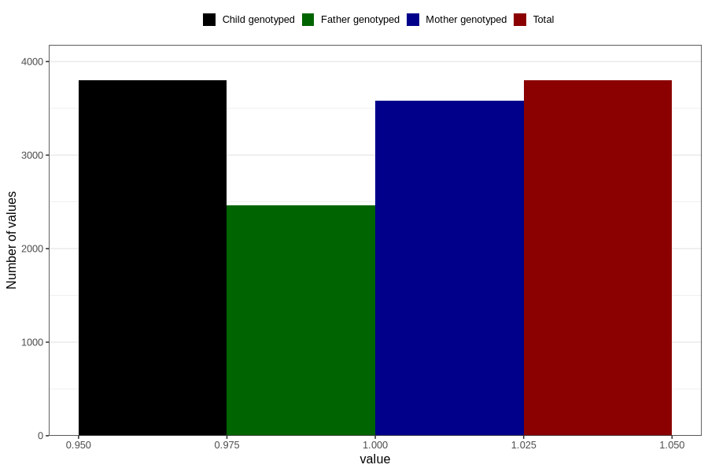

# contraception_used_hormone_iud
Variable mapping to `AA31` in `Skjema1_v12`.
- Number of values:

| Value | Total | Child genotyped | Mother genotyped | Father genotyped |
| ----- | ----- | --------------- | ---------------- | ---------------- |
| Missing | 77008 | 77008 | 72445 | 50702 |
| Non-missing | 3798 | 3798 | 3579 | 2461 |
| 1 | 3798 | 3798 | 3579 | 2461 |

