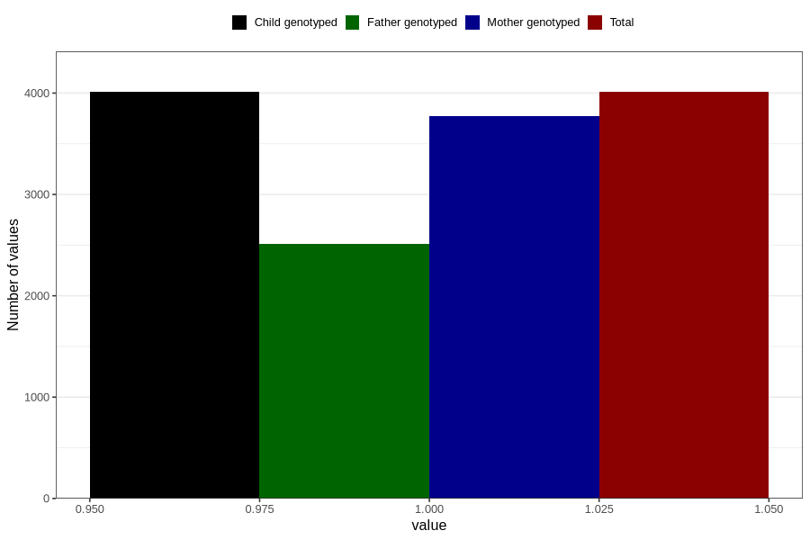

# contraception_used_iud
Variable mapping to `AA30` in `Skjema1_v12`.
- Number of values:

| Value | Total | Child genotyped | Mother genotyped | Father genotyped |
| ----- | ----- | --------------- | ---------------- | ---------------- |
| Missing | 76796 | 76796 | 72247 | 50648 |
| Non-missing | 4010 | 4010 | 3777 | 2515 |
| 1 | 4010 | 4010 | 3777 | 2515 |

