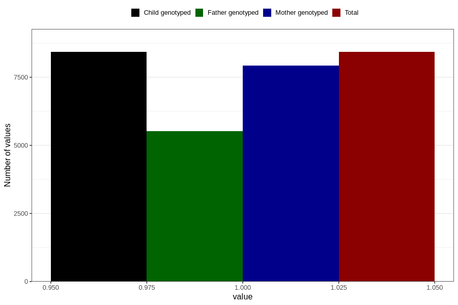

# contraception_used_safe_period
Variable mapping to `AA36` in `Skjema1_v12`.
- Number of values:

| Value | Total | Child genotyped | Mother genotyped | Father genotyped |
| ----- | ----- | --------------- | ---------------- | ---------------- |
| Missing | 72380 | 72380 | 68099 | 47648 |
| Non-missing | 8426 | 8426 | 7925 | 5515 |
| 1 | 8426 | 8426 | 7925 | 5515 |

