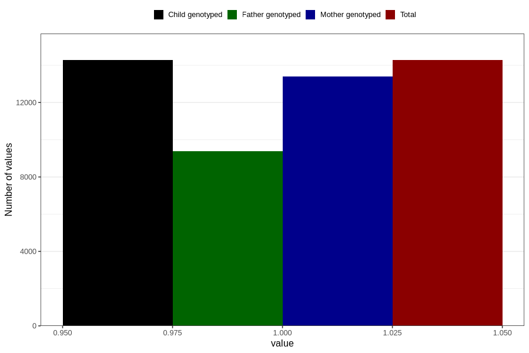

# contraception_used_withdrawal
Variable mapping to `AA37` in `Skjema1_v12`.
- Number of values:

| Value | Total | Child genotyped | Mother genotyped | Father genotyped |
| ----- | ----- | --------------- | ---------------- | ---------------- |
| Missing | 66532 | 66532 | 62619 | 43795 |
| Non-missing | 14274 | 14274 | 13405 | 9368 |
| 1 | 14274 | 14274 | 13405 | 9368 |

