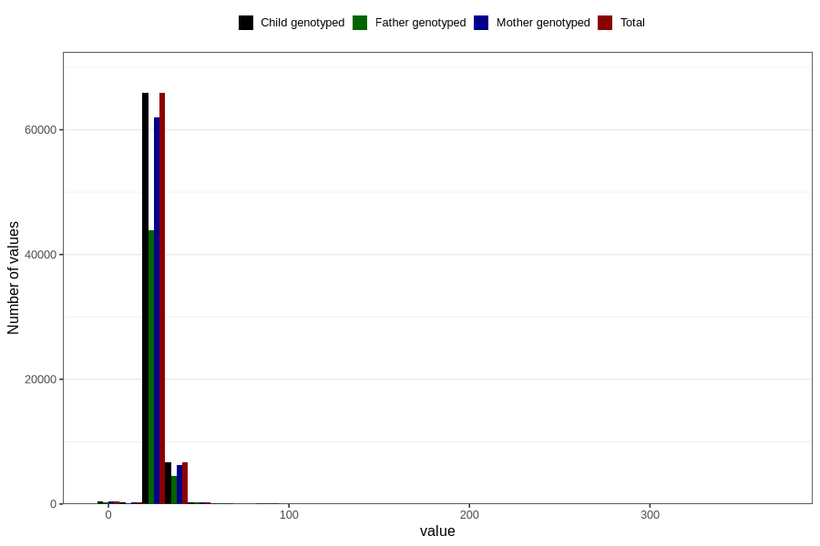

# menstrual_cycle_length
Variable mapping to `AA13` in `Skjema1_v12`.
Variable mapping to `AA13` in `Skjema1_v12`.
- Number of values:

| Value | Total | Child genotyped | Mother genotyped | Father genotyped |
| ----- | ----- | --------------- | ---------------- | ---------------- |
| Missing | 6837 | 6837 | 6390 | 4002 |
| Non-missing | 73969 | 73969 | 69634 | 49161 |
| 25th percentile | 28 | 28 | 28 | 28 |
| 50th percentile | 28 | 28 | 28 | 28 |
| 75th percentile | 30 | 30 | 30 | 30 |
| Mean | 28.5924373724128 | 28.5924373724128 | 28.5882902030617 | 28.6553162059356 |
| Standard deviation | 5.26249402959833 | 5.26249402959833 | 5.24793178449921 | 5.18023080118749 |
| N | 73969 | 73969 | 69634 | 49161 |

