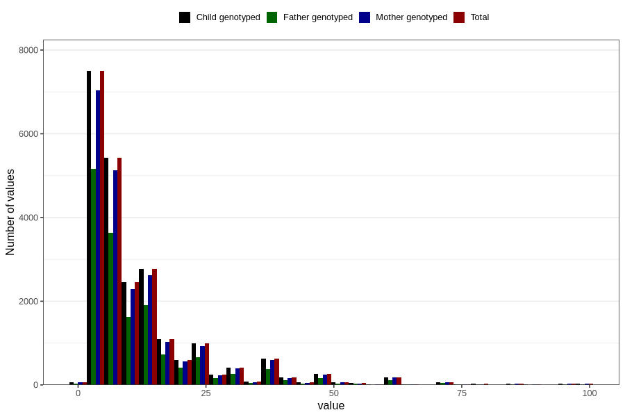

# months_intercourse_without_contraception_2
Variable mapping to `AA48` in `Skjema1_v12`.
- Number of values:

| Value | Total | Child genotyped | Mother genotyped | Father genotyped |
| ----- | ----- | --------------- | ---------------- | ---------------- |
| Missing | 57553 | 57553 | 54133 | 37503 |
| Non-missing | 23253 | 23253 | 21891 | 15660 |
| 25th percentile | 5 | 5 | 5 | 5 |
| 50th percentile | 7 | 7 | 7 | 7 |
| 75th percentile | 14 | 14 | 14 | 13 |
| Mean | 12.1760202984561 | 12.1760202984561 | 12.2101776985976 | 11.92656449553 |
| Standard deviation | 12.6008755196599 | 12.6008755196599 | 12.6595761596948 | 12.2227802350671 |
| N | 23253 | 23253 | 21891 | 15660 |

