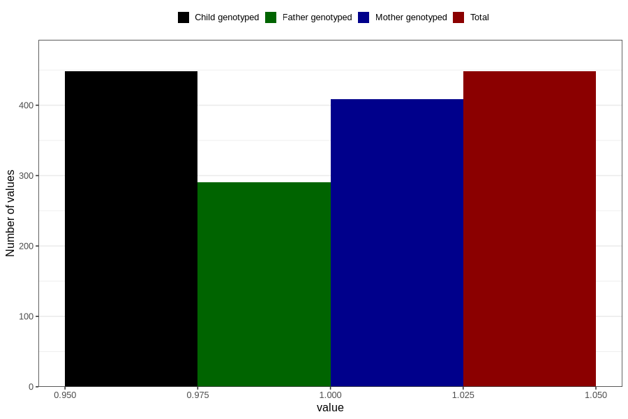

# treated_for_infertility_other
Variable mapping to `AA81` in `Skjema1_v12`.
- Number of values:

| Value | Total | Child genotyped | Mother genotyped | Father genotyped |
| ----- | ----- | --------------- | ---------------- | ---------------- |
| Missing | 80358 | 80358 | 75615 | 52872 |
| Non-missing | 448 | 448 | 409 | 291 |
| 1 | 448 | 448 | 409 | 291 |

