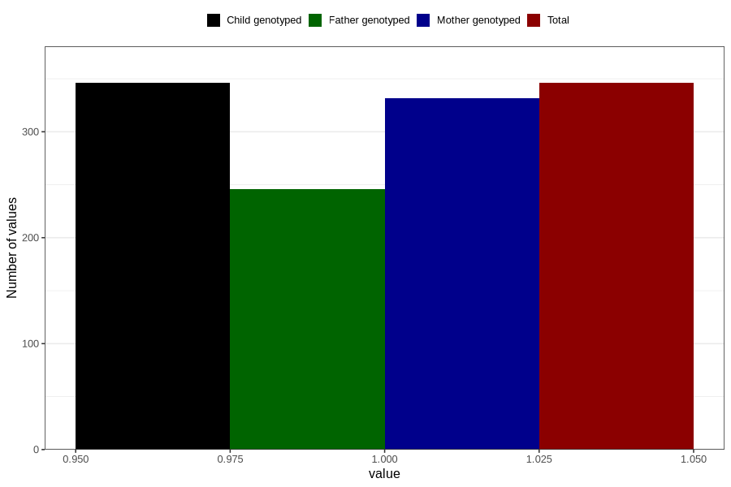

# treated_for_infertility_other_surgery
Variable mapping to `AA71` in `Skjema1_v12`.
- Number of values:

| Value | Total | Child genotyped | Mother genotyped | Father genotyped |
| ----- | ----- | --------------- | ---------------- | ---------------- |
| Missing | 80460 | 80460 | 75692 | 52917 |
| Non-missing | 346 | 346 | 332 | 246 |
| 1 | 346 | 346 | 332 | 246 |

