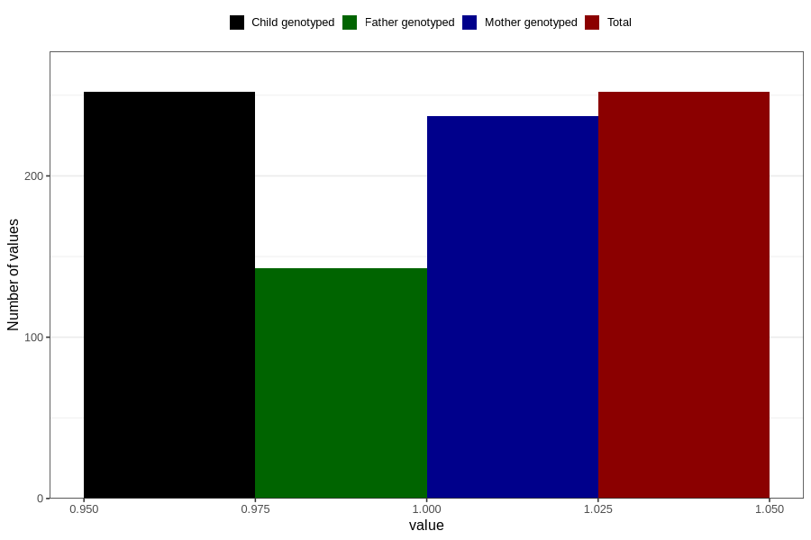

# treated_for_infertility_previous_fallopian_tube_suregery
Variable mapping to `AA68` in `Skjema1_v12`.
- Number of values:

| Value | Total | Child genotyped | Mother genotyped | Father genotyped |
| ----- | ----- | --------------- | ---------------- | ---------------- |
| Missing | 80554 | 80554 | 75787 | 53020 |
| Non-missing | 252 | 252 | 237 | 143 |
| 1 | 252 | 252 | 237 | 143 |

