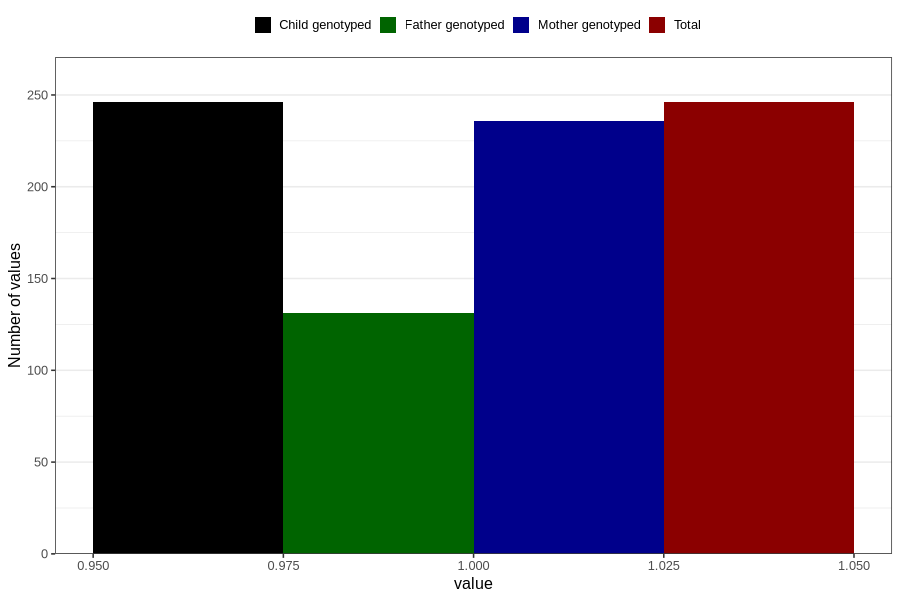

# treated_for_infertility_previous_insemination
Variable mapping to `AA76` in `Skjema1_v12`.
- Number of values:

| Value | Total | Child genotyped | Mother genotyped | Father genotyped |
| ----- | ----- | --------------- | ---------------- | ---------------- |
| Missing | 80560 | 80560 | 75788 | 53032 |
| Non-missing | 246 | 246 | 236 | 131 |
| 1 | 246 | 246 | 236 | 131 |

