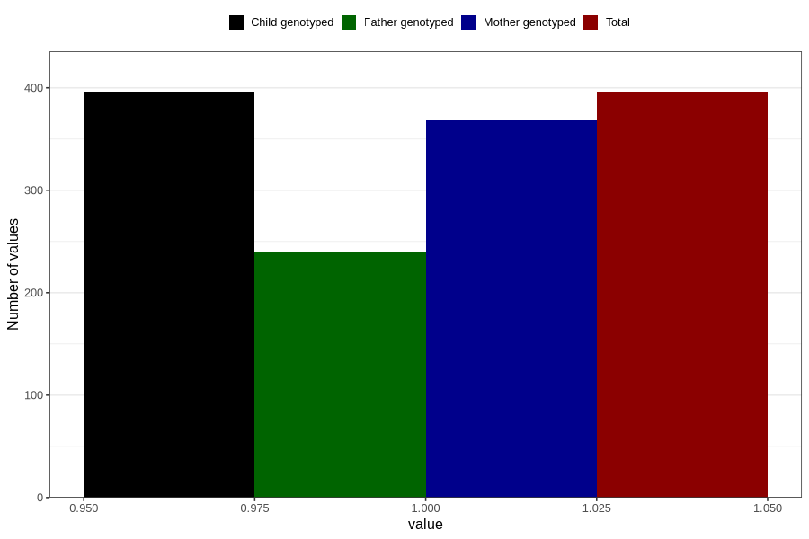

# treated_for_infertility_previous_other
Variable mapping to `AA80` in `Skjema1_v12`.
- Number of values:

| Value | Total | Child genotyped | Mother genotyped | Father genotyped |
| ----- | ----- | --------------- | ---------------- | ---------------- |
| Missing | 80410 | 80410 | 75656 | 52923 |
| Non-missing | 396 | 396 | 368 | 240 |
| 1 | 396 | 396 | 368 | 240 |

