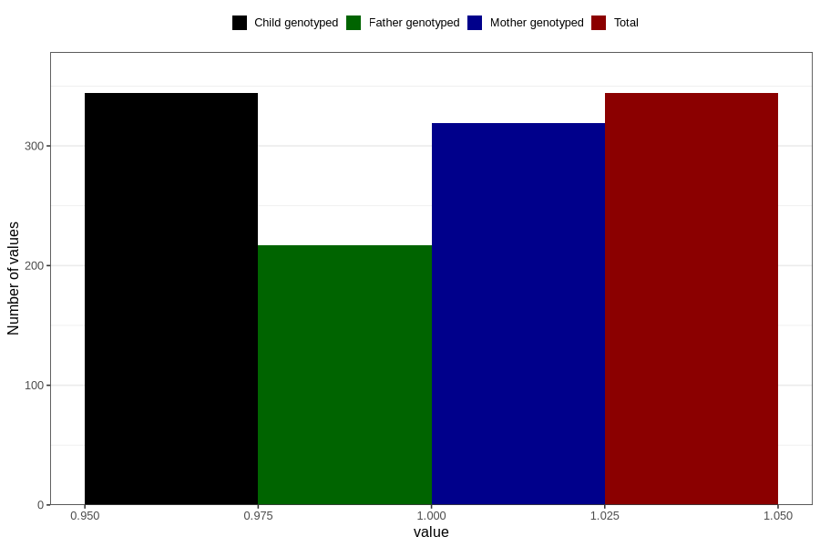

# treated_for_infertility_previous_other_surgery
Variable mapping to `AA70` in `Skjema1_v12`.
- Number of values:

| Value | Total | Child genotyped | Mother genotyped | Father genotyped |
| ----- | ----- | --------------- | ---------------- | ---------------- |
| Missing | 80462 | 80462 | 75705 | 52946 |
| Non-missing | 344 | 344 | 319 | 217 |
| 1 | 344 | 344 | 319 | 217 |

