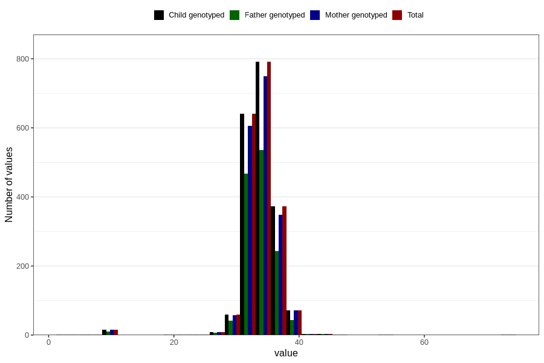

# crown_rump_length
Variable mapping to `SETE_ISSE` in `MFR_541_v12`.
Variable mapping to `CRL` in `Ultralyd`.
- Number of values:

| Value | Total | Child genotyped | Mother genotyped | Father genotyped |
| ----- | ----- | --------------- | ---------------- | ---------------- |
| Missing | 78825 | 78825 | 74149 | 51797 |
| Non-missing | 1981 | 1981 | 1875 | 1366 |
| 25th percentile | 33 | 33 | 33 | 33 |
| 50th percentile | 34 | 34 | 34 | 34 |
| 75th percentile | 35 | 35 | 35 | 35 |
| Mean | 33.9283190307925 | 33.9283190307925 | 33.9232 | 33.8411420204978 |
| Standard deviation | 3.47049768666073 | 3.47049768666073 | 3.49728823137572 | 3.67194370367597 |
| N | 1981 | 1981 | 1875 | 1366 |

