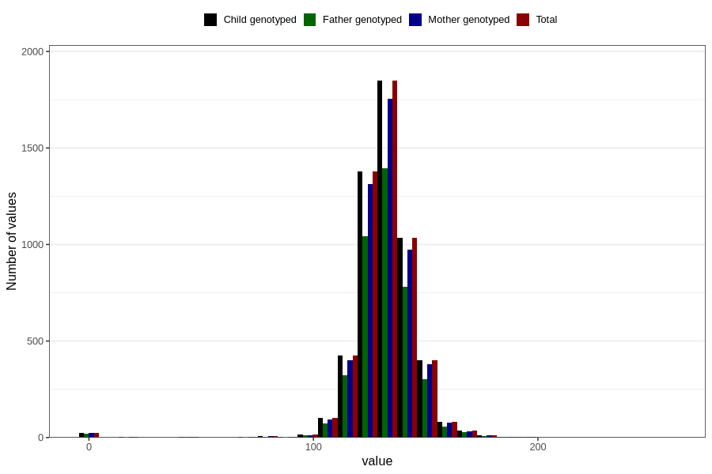

# abdominal_circumference
Variable mapping to `AC` in `Ultralyd`.
- Number of values:

| Value | Total | Child genotyped | Mother genotyped | Father genotyped |
| ----- | ----- | --------------- | ---------------- | ---------------- |
| Missing | 75426 | 75426 | 70920 | 49105 |
| Non-missing | 5380 | 5380 | 5104 | 4058 |
| 25th percentile | 125 | 125 | 125 | 125 |
| 50th percentile | 132 | 132 | 132 | 132 |
| 75th percentile | 139 | 139 | 139 | 139 |
| Mean | 131.789219330855 | 131.789219330855 | 131.807210031348 | 131.803844258255 |
| Standard deviation | 14.927606023334 | 14.927606023334 | 14.8799118391721 | 14.9368720097263 |
| N | 5380 | 5380 | 5104 | 4058 |

