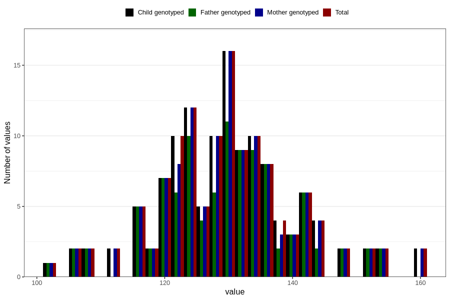

# abdominal_circumference_fetus2
Variable mapping to `AC_F2` in `Ultralyd`.
- Number of values:

| Value | Total | Child genotyped | Mother genotyped | Father genotyped |
| ----- | ----- | --------------- | ---------------- | ---------------- |
| Missing | 80680 | 80680 | 75901 | 53062 |
| Non-missing | 126 | 126 | 123 | 101 |
| 25th percentile | 124 | 124 | 124 | 124 |
| 50th percentile | 130 | 130 | 130 | 131 |
| 75th percentile | 136 | 136 | 136 | 136 |
| Mean | 130.293650793651 | 130.293650793651 | 130.365853658537 | 130.079207920792 |
| Standard deviation | 10.5747377917885 | 10.5747377917885 | 10.6280392318073 | 10.3437741355047 |
| N | 126 | 126 | 123 | 101 |

