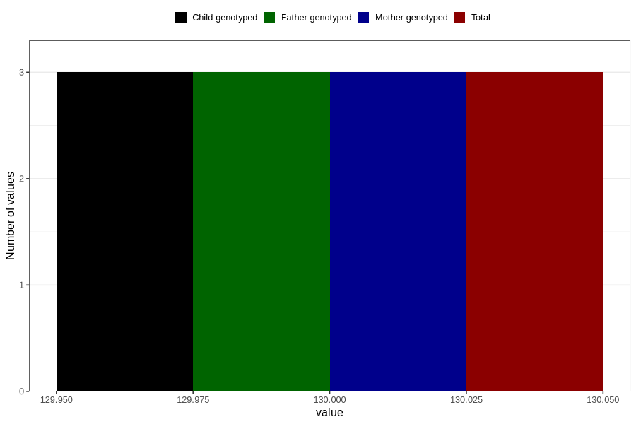

# abdominal_circumference_fetus3
Variable mapping to `AC_F3` in `Ultralyd`.
- Number of values:

| Value | Total | Child genotyped | Mother genotyped | Father genotyped |
| ----- | ----- | --------------- | ---------------- | ---------------- |
| Missing | 80803 | 80803 | 76021 | 53160 |
| Non-missing | 3 | 3 | 3 | 3 |
| 130 | 3 | 3 | 3 | 3 |

