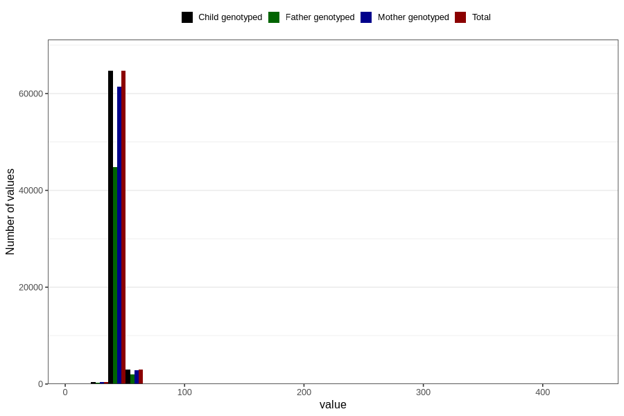

# biparietal_diameter
Variable mapping to `BPD` in `Ultralyd`.
- Number of values:

| Value | Total | Child genotyped | Mother genotyped | Father genotyped |
| ----- | ----- | --------------- | ---------------- | ---------------- |
| Missing | 12734 | 12734 | 11347 | 5978 |
| Non-missing | 68072 | 68072 | 64677 | 47185 |
| 25th percentile | 43 | 43 | 43 | 43 |
| 50th percentile | 45 | 45 | 45 | 45 |
| 75th percentile | 47 | 47 | 47 | 47 |
| Mean | 44.8711511340933 | 44.8711511340933 | 44.8744839742103 | 44.8606972554837 |
| Standard deviation | 3.79115920410906 | 3.79115920410906 | 3.809549062874 | 3.91012372507068 |
| N | 68072 | 68072 | 64677 | 47185 |

